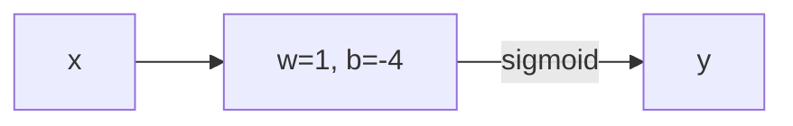

# SimpleMAML-tensorflow

This repo implements MAML [1] (Model-Agnostic Meta Learning) in TensorFlow and verifies its correctness by cross-checking the meta-gradients against those calculated by hand using a single neuron model. This repo contains MAML implementation for two NN architectures, a toy example using a single neuron with a weight $w$ and bias $b$, and a more complex CNN architecture EEGNet [2]. For more info, open the notebook files MAML_single_neuron.ipynb and MAML_EEGNet_CNN.ipynb.

I verified my implementation on a single neuron because during my work, I found numerous GitHub repositories with incorrect implementations of MAML which either only calculated single derivates or did not correctly calculate the double derivatives needed for the algorithm, leading to suboptimal performance. I also wrote a post on this. [Link to the medium post](https://medium.com/@ekanshgupta340/a-simple-method-to-implement-maml-in-tensorflow-7b8981df76d3).

## MAML Optimization

MAML optimizes a model’s initial parameters such that it can adapt to new tasks with only a few gradient updates. The core idea is to minimize the loss across multiple tasks by computing gradients of gradients (i.e., second-order derivatives). The update rule for MAML is given by:

$$
\theta^* = \theta - \alpha \nabla_\theta \sum_{\mathcal{T}_i \sim p(\mathcal{T})} \mathcal{L}_{\mathcal{T}_i} \left( \theta - \beta \nabla_\theta \mathcal{L}_{\mathcal{T}_i} (\theta) \right)
$$

where: $θ$ are the model parameters, $α$ is the meta-learning rate, $β$ is the inner-loop learning rate, $L_{T_i}$ is the loss on task $T_i$, and $p(T)$ is the distribution over tasks. The basic idea is that we are not optimizing $θ$ based on what $θ$ minimizes our loss, but rather based on what $θ’$ minimizes our loss ($θ’$ is a function of $θ$).

## My Approach to Implementing MAML

To ensure that my MAML implementation was correct, I first tested it on a minimal architecture: a single neuron. After verifying the correctness of my implementation on this simple case, I extended it to a Convolutional Neural Network (CNN) architecture, specifically EEGNet, which is commonly used for processing EEG brain signal data. This will hopefully help people who aren’t sure if they are implementing this algorithm correctly and provide a framework for implementing MAML on any custom neural net. 

## Architecture of the single neuron

Single neuron with parameters: $w = 1$, $b = -4$

Input $x = 1$, label $y = 1$ (same for both base and meta updates)

Activation: sigmoid

Loss: binary cross entropy

Learning rate $\alpha = 1$ for inner loop

## Derivation of meta loss on a single neuron

Step 1: Forward Pass (Base Model)

$$
z = wx + b = 1 \times 1 + (-4) = -3
$$

$$
\sigma(z) = \frac{1}{1 + e^{-z}} = \frac{1}{1 + e^3} = \frac{1}{1 + 20.0855...} \approx 0.0474
$$

Step 2: Calculate Base Loss

$$
L(\theta) = -[y \log(\sigma(z)) + (1-y)\log(1-\sigma(z))]
$$

$$
= -[1 \times \log(0.0474) + 0 \times \log(1-0.0474)]
$$

$$
= -\log(0.0474) \approx 3.0491
$$

Step 3: Calculate Base Gradients

The gradient of cross entropy w.r.t z is $\sigma(z)-1$ 

$$
\frac{\partial L(\sigma(z))}{\partial z} = \sigma(z) - 1
$$

We also know that $z = w*x + b$ (where $x$ is equal to 1) so that the gradient of $z$ w.r.t both $w$ and $b$ is 1. Hence the gradient for both $w$ and $b$ is:

$$
\frac{\partial L(w+b)}{\partial w} = \frac{\partial L(w+b)}{\partial b} = (\sigma(w+b) - 1)*1 = -0.9526
$$

Step 4: Inner Loop Update ($\alpha = 1$)

$$
w' = w - \alpha \times \frac{\partial L}{\partial w} = 1 - (\sigma(w+b) - 1) = 2 - \sigma(w+b) = 1.9526
$$

$$
b' = b - \alpha \times \frac{\partial L}{\partial b} = -4 - (\sigma(w+b) - 1) = -3 - \sigma(w+b) = -3.0474
$$

Step 5: Forward Pass with Updated Parameters (Meta Model)
Using the same input $x = 1$:

$$
z' = w'x + b' = 1.9526 \times 1 + (-3.0474) = -1.0948
$$

$$
\sigma(z') = \frac{1}{1 + e^{-z'}} = \frac{1}{1 + e^{1.0948}} \approx 0.2510
$$

Step 6: Calculate Meta Loss

$$
L_{\text{meta}}(\theta') = -[y \log(\sigma(z')) + (1-y)\log(1-\sigma(z'))]
$$

$$
= -\log(0.2510) \approx 1.3822
$$

Step 7: Calculate MAML Gradients (Meta Gradients)
Now we calculate the MAML gradients (which is the derivate of the meta loss) w.r.t to the original parameters $w$ and $b$. So we are interested in computing

$$
\frac{\partial L_{\text{meta}}}{\partial \theta} = \frac{\partial L(\theta')}{\partial \theta} = \frac{\partial L(\theta')}{\partial \theta'}*\frac{\partial \theta'}{\partial \theta}
$$

$$
 \frac{\partial L(\theta')}{\partial \theta'} = \frac{\partial L(\sigma(\theta'))}{\partial \theta'} = \sigma(\theta') - 1
$$

$$
 \frac{\partial \theta'}{\partial \theta} = \frac{\partial [w - (\sigma(w+b)-1) + b - (\sigma(w+b)-1)]}{\partial \theta}
$$

By symmetry, we can see that:

$$
 \frac{\partial L(\theta')}{\partial w} =  \frac{\partial L(\theta')}{\partial b} 
$$

So it should suffice to calculate just one of these quantities

$$
 \frac{\partial \theta'}{\partial w} = \frac{\partial [w - (\sigma(w+b)-1) + b - (\sigma(w+b)-1)]}{\partial w} = 1 - 2 \frac{\partial \sigma(w+b)}{\partial w}
$$

Now, we know that the derivative of a sigmoid function is the following

$$
 \frac{\partial \sigma(x)}{\partial x} = \sigma(x)(1-\sigma(x))
$$

So our meta gradient reduces to the following

$$
 \frac{\partial L(\theta')}{\partial w}  = (\sigma(\theta') - 1)*(1 - 2\sigma(\theta)(1-\sigma(\theta)))
$$

Plugging up the numbers, we get 

$$
 \frac{\partial L(\theta')}{\partial w} = (\sigma(\theta') - 1)*\sigma(\theta)(1-\sigma(\theta)) = (0.2510-1)*(1 - 2*0.0474*0.9526)
$$

$$
 \frac{\partial L(\theta')}{\partial w} = \frac{\partial L(\theta')}{\partial b} \approx -0.6813
$$

Which is what the meta gradient value should be for a correctly implemented MAML algorithm for this single neuron model.

## References

[1] Finn, Chelsea, Pieter Abbeel, and Sergey Levine. "Model-agnostic meta-learning for fast adaptation of deep networks." _International conference on machine learning_. PMLR, 2017

[2] Lawhern, Vernon J., et al. "EEGNet: a compact convolutional neural network for EEG-based brain–computer interfaces." _Journal of neural engineering_ 15.5 (2018): 056013.